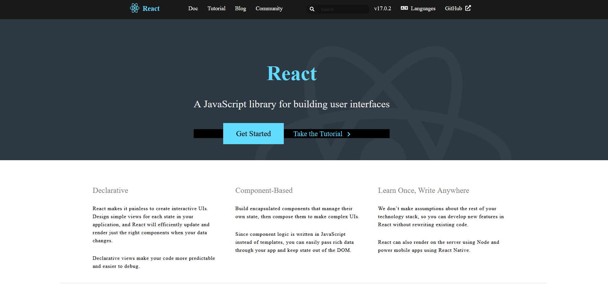
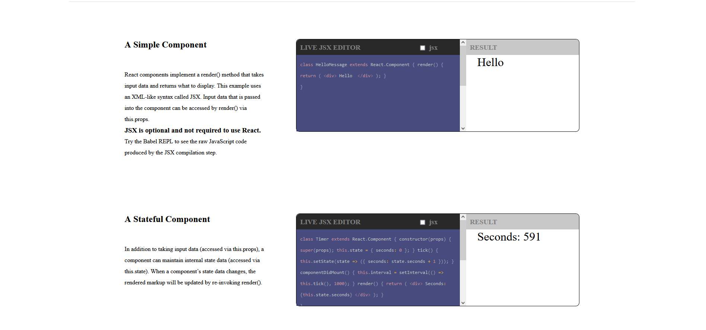
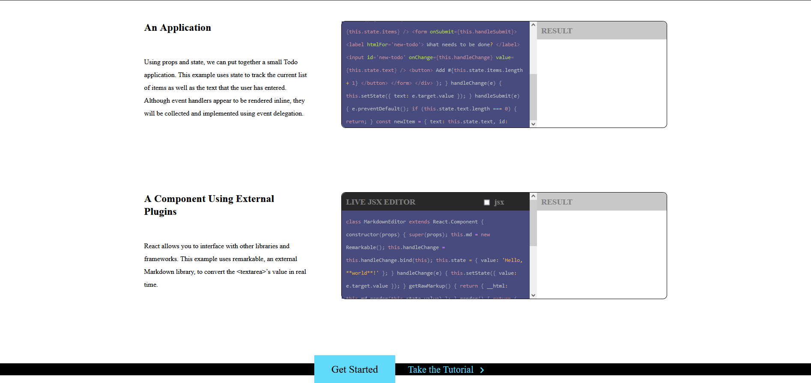

# `This is React Website Copy`

## This is screenshot for the navbar when you click on any link in the navbar it will navigate to that specific link in React Website

## This example shows how React component can be used with different way for example her we use the same component with different functionality the first one it display Live JSX editor you can write the code and wou will see the result in the right side , the second one it will count the seconds and display it in the right side

## This is another example of how we can use React Components with some explaining about using props and state , the last example uses remarkable, an external Markdown library, to convert the < textarea >’s value in real time

